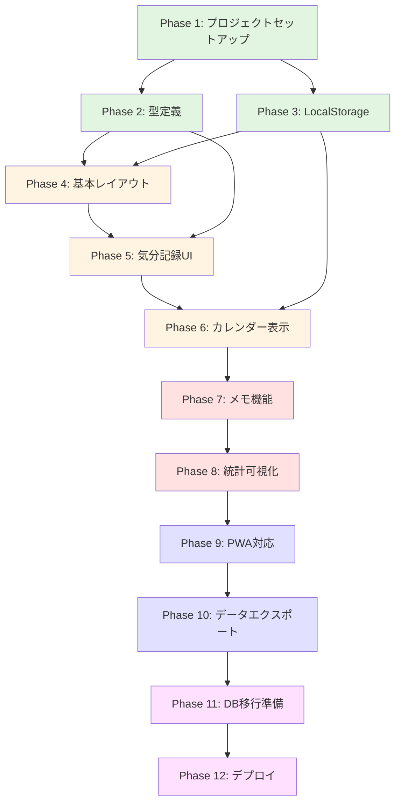
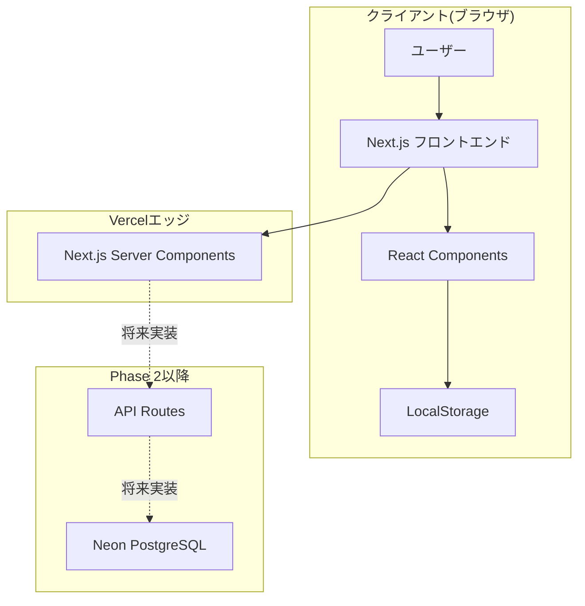

# MoodTap プロジェクト全体概要

**作成日**: 2025年10月23日
**ドキュメントバージョン**: 1.0
**対象者**: 開発者、プロジェクトマネージャー

---

## 目次

1. [プロジェクト概要](#プロジェクト概要)
2. [ビジョンと目的](#ビジョンと目的)
3. [開発方針と設計思想](#開発方針と設計思想)
4. [技術スタック詳細解説](#技術スタック詳細解説)
5. [全Phase一覧とフローチャート](#全phase一覧とフローチャート)
6. [開発スケジュール見積もり](#開発スケジュール見積もり)
7. [リスク管理マトリクス](#リスク管理マトリクス)
8. [チーム体制](#チーム体制)
9. [成功基準(KPI)](#成功基準kpi)
10. [アーキテクチャ図](#アーキテクチャ図)

---

## プロジェクト概要

### プロジェクト名
**MoodTap (ムードタップ)** - 1タップ気分記録アプリ

### エグゼクティブサマリー

MoodTapは、1日1回、気分を5段階のアイコンでタップするだけで記録し、カレンダー形式で可視化するセルフケア習慣化アプリです。「3秒で完了」という極限のシンプルさにより、メンタルヘルス管理の継続ハードルを限りなくゼロに近づけます。

本プロジェクトは、メンタルヘルス・ウェルネス市場の成長トレンドと、マイクロ習慣化の文化的潮流を捉え、個人ユーザー(BtoC)から企業導入(BtoB)まで幅広い展開を見据えた、スケーラブルなWebアプリケーションです。

### プロジェクトの背景

#### 市場機会
- **メンタルヘルス市場**: 年率20%成長、2030年には6兆円規模
- **マイクロ習慣化**: 「Atomic Habits」等のベストセラー書籍の影響
- **企業のウェルビアイング投資**: 福利厚生としてのメンタルヘルスツール導入増加

#### 解決する課題
1. **継続の困難**: 詳細な日記アプリは面倒で続かない
2. **時間の制約**: 忙しいビジネスパーソンは記録に時間を割けない
3. **言語化の苦手**: 感情を言葉にすることに抵抗がある人が多い
4. **可視化の欠如**: 自分の気分傾向を客観的に把握できない

#### MoodTapのユニーク・バリュー・プロポジション(UVP)
> **「1タップで完了、カレンダーで可視化」**
>
> 他の日記・習慣化アプリとの圧倒的な差別化ポイントは、**3秒で完了する記録体験**です。感情を言語化せず、アイコンをタップするだけで、後からカレンダーで自分の気分の波を確認できます。

---

## ビジョンと目的

### ビジョン
> 「セルフケアを誰もが当たり前にできる世界を創る」
>
> 複雑なツールや専門知識がなくても、誰もが自分の心の健康を管理できる環境を提供します。

### プロジェクトの目的

1. **マイクロ習慣の実現**
   - 1日1回の気分記録を習慣化(継続率80%以上)
   - 心理的負担ゼロの記録体験
   - ゲーミフィケーション(ストリーク表示)

2. **メンタルヘルスの可視化**
   - カレンダーでの気分トレンド把握
   - 週次/月次の統計レポート
   - カウンセラーへの相談資料として活用

3. **スケーラブルな成長**
   - BtoC: 個人ユーザー獲得
   - BtoB: 企業人事部門への導入
   - グローバル展開の基盤構築

### ターゲットユーザー

| ユーザー層 | ニーズ | 利用シーン | 期待ROI |
|-----------|--------|-----------|--------|
| **20-30代ビジネスパーソン** | 手軽にメンタルヘルス管理 | 通勤時3秒記録 | ストレス軽減 |
| **HSP(繊細な人)** | 感情の客観視 | 1日の終わりの振り返り | 自己理解向上 |
| **カウンセリング利用者** | 治療の可視化 | セッション前の記録共有 | 治療効果向上 |
| **企業人事担当** | 従業員メンタルヘルス把握 | 月次レポート確認 | 休職率減少 |

---

## 開発方針と設計思想

### コア原則

#### 1. 極限のシンプルさ(KISS原則)
- **1タップで完了**: 気分記録は5段階アイコンのみ
- **ノイズレスUI**: 余計な要素を徹底排除
- **高速レスポンス**: 記録から保存まで1秒以内

#### 2. 習慣化ドリブン
- **毎日の楽しみ**: 心地よいアニメーション
- **ゲーミフィケーション**: ストリーク(連続記録日数)表示
- **視覚的報酬**: カレンダーが埋まる達成感

#### 3. データ駆動の自己理解
- **可視化**: カレンダー・グラフでの傾向把握
- **統計**: 週次/月次の平均スコア
- **エクスポート**: CSV形式での共有(将来実装)

#### 4. 拡張性の確保
- **モジュラー設計**: コンポーネントの独立性
- **段階的認証**: Phase 1はローカル、Phase 2でNextAuth
- **スケーラブルDB**: Neon PostgreSQLで将来のトラフィック増加に対応

### 技術的制約と意図的な省略

本プロトタイプでは、以下の機能を**意図的にスコープ外**としています:

| 省略機能 | 理由 | 将来の拡張可能性 |
|---------|------|----------------|
| ユーザー認証 | MVP段階ではLocalStorageで十分 | Phase 2でNextAuth.js導入 |
| プッシュ通知 | 習慣化の補助だが、MVPの核心ではない | Phase 3でWeb Push API |
| AI分析 | 高度な機能で開発工数が大 | Phase 4でOpenAI統合 |
| ソーシャル機能 | メンタルヘルスはプライベート | Phase 5で慎重検討 |

---

## 技術スタック詳細解説

### フロントエンド技術

#### Next.js 14 (App Router)

**選定理由:**
- **Server Components**: 初回ロード高速化、SEO最適化
- **File-based Routing**: 直感的なルーティング
- **Vercel最適化**: デプロイの簡素化

**活用パターン:**
```typescript
// app/page.tsx (Server Component)
export default async function HomePage() {
  // サーバーサイドでの初期データ取得(将来Phase 2で実装)
  return <HomeClient />;
}

// app/HomeClient.tsx (Client Component)
'use client';
export function HomeClient() {
  const [entries, setEntries] = useState<MoodEntry[]>([]);
  // クライアントサイドのインタラクティブな操作
}
```

#### TypeScript 5+

**選定理由:**
- **型安全性**: コンパイル時のエラー検出
- **開発者体験**: IntelliSenseによる補完
- **リファクタリング容易性**: 型情報による安全な変更

**型システム設計:**
```typescript
// types/mood.ts
export interface MoodEntry {
  id: string;
  date: string; // ISO 8601
  moodScore: 1 | 2 | 3 | 4 | 5; // Union型による制限
  moodLabel: MoodLabel;
  note?: string;
  createdAt: string;
}

export type MoodLabel = 'very_bad' | 'bad' | 'neutral' | 'good' | 'very_good';

// Type Guards
export function isMoodEntry(obj: unknown): obj is MoodEntry {
  return (
    typeof obj === 'object' &&
    obj !== null &&
    'id' in obj &&
    'date' in obj &&
    'moodScore' in obj
  );
}
```

#### Tailwind CSS 3+

**選定理由:**
- **高速開発**: ユーティリティクラスによる迅速なスタイリング
- **一貫性**: デザインシステムの統一
- **バンドルサイズ最適化**: 使用クラスのみ出力

**カスタム設定:**
```typescript
// tailwind.config.ts
export default {
  theme: {
    extend: {
      colors: {
        mood: {
          veryBad: '#EF4444',
          bad: '#FB923C',
          neutral: '#9CA3AF',
          good: '#60A5FA',
          veryGood: '#3B82F6',
        },
      },
      animation: {
        'bounce-in': 'bounceIn 0.5s ease-out',
      },
    },
  },
};
```

### バックエンド・データベース技術

#### Phase 1: LocalStorage(クライアントサイド)

**選定理由:**
- **MVP高速化**: サーバー不要で即座にプロトタイプ作成
- **認証不要**: ローカルデータで誰でもすぐ利用可能
- **オフライン動作**: ネットワーク不要

**データ構造:**
```typescript
// lib/localStorage.ts
export const STORAGE_KEY = 'moodtap_entries';

export function saveMoodEntry(entry: MoodEntry): void {
  const entries = getMoodEntries();
  entries.push(entry);
  localStorage.setItem(STORAGE_KEY, JSON.stringify(entries));
}

export function getMoodEntries(): MoodEntry[] {
  const data = localStorage.getItem(STORAGE_KEY);
  if (!data) return [];
  try {
    return JSON.parse(data);
  } catch {
    return [];
  }
}
```

#### Phase 2: Drizzle ORM + Neon PostgreSQL

**選定理由:**
- **型安全性**: TypeScriptとの完全統合
- **軽量**: Prismaより小さいバンドルサイズ
- **サーバーレス**: Neonの自動スケーリング

**スキーマ定義:**
```typescript
// lib/db/schema.ts
import { pgTable, uuid, varchar, date, smallint, text, timestamp } from 'drizzle-orm/pg-core';

export const moodEntries = pgTable('mood_entries', {
  id: uuid('id').defaultRandom().primaryKey(),
  userId: uuid('user_id').notNull(),
  date: date('date').notNull(),
  moodScore: smallint('mood_score').notNull(),
  moodLabel: varchar('mood_label', { length: 20 }).notNull(),
  note: text('note'),
  createdAt: timestamp('created_at', { withTimezone: true }).defaultNow().notNull(),
});

export type MoodEntry = typeof moodEntries.$inferSelect;
```

### デプロイ・インフラ

#### Vercel

**選定理由:**
- **Next.js最適化**: 開発元による完全サポート
- **自動CI/CD**: GitHubプッシュで自動デプロイ
- **エッジネットワーク**: グローバルCDN
- **無料枠**: 個人プロジェクトに十分

---

## 全Phase一覧とフローチャート

### Phase概要

プロジェクトは12のPhaseに分割され、段階的に機能を実装します。Phase 1-8が**MVP(Minimum Viable Product)**として最優先で開発されます。

### Phase詳細

#### Phase 1: プロジェクトセットアップ (30-45分)

**目的:** 開発環境の構築とベース設定

**タスク:**
1. Next.js 14プロジェクト初期化
2. TypeScript設定
3. Tailwind CSS設定
4. ディレクトリ構造作成
5. Git初期化

**詳細ドキュメント:** `20251023_01-project-setup.md`

---

#### Phase 2: 型定義とユーティリティ (45-60分)

**目的:** TypeScript型システムの構築

**タスク:**
1. MoodEntry型定義
2. MoodLabel型定義
3. ユーティリティ関数(日付操作等)

**詳細ドキュメント:** `20251023_02-type-definitions.md`

---

#### Phase 3: LocalStorageデータ管理 (30-45分)

**目的:** クライアントサイドデータ永続化

**タスク:**
1. LocalStorage CRUD操作関数
2. エラーハンドリング
3. データバリデーション

**詳細ドキュメント:** `20251023_03-local-storage.md`

---

#### Phase 4: 基本レイアウトとUI (60-90分)

**目的:** ランディングページとダッシュボードの構築

**タスク:**
1. ランディングページ
2. ダッシュボードレイアウト
3. ナビゲーション

**詳細ドキュメント:** `20251023_04-basic-layout.md`

---

#### Phase 5: 気分記録UIコンポーネント (90-120分)

**目的:** 5段階アイコンボタンの実装

**タスク:**
1. MoodIconButtonコンポーネント
2. 記録完了フィードバック
3. アニメーション

**詳細ドキュメント:** `20251023_05-mood-recording.md`

---

#### Phase 6: カレンダー表示機能 (90-120分)

**目的:** 月次カレンダーとヒートマップ

**タスク:**
1. MoodCalendarコンポーネント
2. ヒートマップカラー
3. 日付クリックで詳細表示

**詳細ドキュメント:** `20251023_06-calendar-display.md`

---

#### Phase 7: メモ機能 (60-90分)

**目的:** オプションメモ入力

**タスク:**
1. MoodNoteInputコンポーネント
2. 文字数制限(100文字)
3. 折りたたみUI

**詳細ドキュメント:** `20251023_07-note-feature.md`

---

#### Phase 8: 統計・可視化機能 (60-90分)

**目的:** 週次/月次グラフ

**タスク:**
1. 折れ線グラフコンポーネント
2. 平均スコア計算
3. ストリーク表示

**詳細ドキュメント:** `20251023_08-stats-visualization.md`

---

#### Phase 9: PWA対応 (30-45分)

**目的:** オフライン利用とホーム画面追加

**タスク:**
1. manifest.json設定
2. Service Worker
3. アイコン・スプラッシュスクリーン

**詳細ドキュメント:** `20251023_09-pwa-setup.md`

---

#### Phase 10: データエクスポート (30-45分)

**目的:** CSV形式でのエクスポート

**タスク:**
1. CSV生成ロジック
2. ダウンロード機能

**詳細ドキュメント:** `20251023_10-data-export.md`

---

#### Phase 11: データベース移行準備 (45-60分)

**目的:** Neon PostgreSQL + Drizzle ORM設定

**タスク:**
1. Neonアカウント作成
2. Drizzle ORMスキーマ定義
3. マイグレーション

**詳細ドキュメント:** `20251023_11-database-migration.md`

---

#### Phase 12: 最終調整とデプロイ (45-60分)

**目的:** バグフィックス、UI/UX改善、本番デプロイ

**タスク:**
1. エッジケーステスト
2. パフォーマンス最適化
3. Vercelデプロイ

**詳細ドキュメント:** `20251023_12-deployment.md`

---

### Phase間の依存関係フローチャート



---

## 開発スケジュール見積もり

### 総見積時間: 14-18時間

### タスクブレイクダウン(累計時間)

| Phase | タスク | 最小時間 | 最大時間 | 累計(最大) |
|-------|--------|---------|---------|----------|
| **Phase 1** | プロジェクトセットアップ | 30分 | 45分 | 0:45 |
| **Phase 2** | 型定義 | 45分 | 60分 | 1:45 |
| **Phase 3** | LocalStorage | 30分 | 45分 | 2:30 |
| **Phase 4** | 基本レイアウト | 60分 | 90分 | 4:00 |
| **Phase 5** | 気分記録UI | 90分 | 120分 | 6:00 |
| **Phase 6** | カレンダー表示 | 90分 | 120分 | 8:00 |
| **Phase 7** | メモ機能 | 60分 | 90分 | 9:30 |
| **Phase 8** | 統計可視化 | 60分 | 90分 | 11:00 |
| **Phase 9** | PWA対応 | 30分 | 45分 | 11:45 |
| **Phase 10** | データエクスポート | 30分 | 45分 | 12:30 |
| **Phase 11** | DB移行準備 | 45分 | 60分 | 13:30 |
| **Phase 12** | 最終調整・デプロイ | 45分 | 60分 | **14:30** |

### 開発モデル: アジャイルスプリント

**スプリント構成:**
- **Sprint 1 (2-3時間)**: Phase 1-3 (基盤構築)
- **Sprint 2 (3-4時間)**: Phase 4-6 (UI実装)
- **Sprint 3 (2-3時間)**: Phase 7-9 (機能拡張)
- **Sprint 4 (2-3時間)**: Phase 10-12 (仕上げ・デプロイ)

**実稼働日数見積:**
- **集中開発**: 2-3日(1日6時間作業)
- **通常ペース**: 4-5日(1日3-4時間作業)

---

## リスク管理マトリクス

### リスク一覧

| ID | リスク項目 | 影響度 | 確率 | 軽減策 | 対応策 |
|----|-----------|-------|------|--------|--------|
| R1 | LocalStorageデータ破損 | 中 | 中 | エラーハンドリング強化 | 自動バックアップ機能 |
| R2 | カレンダーライブラリの学習曲線 | 低 | 中 | 公式ドキュメント精読 | 自作コンポーネント検討 |
| R3 | Neon無料枠の制限超過 | 中 | 低 | データ量監視 | 有料プラン移行 |
| R4 | スコープクリープ | 高 | 高 | Phase管理徹底 | MVP優先、Phase 2以降回し |
| R5 | Vercelデプロイエラー | 中 | 低 | ローカルビルドテスト | ビルドログ確認 |

---

## チーム体制

### プロジェクト構成
**1名のプロジェクトマネージャー(PM) + AIエージェント**

### 役割定義

#### プロジェクトマネージャー(あなた)
- プロジェクト全体の意思決定
- Phase進行管理
- コード品質確認

#### AIエージェント(Claude)
- コード実装
- ドキュメント作成
- 技術調査

---

## 成功基準(KPI)

### 技術的KPI
- [ ] ビルド成功率: 100%
- [ ] TypeScript型エラー: 0件
- [ ] Lighthouse Performance: 90点以上
- [ ] Lighthouse Accessibility: 95点以上

### 機能的KPI
- [ ] 気分記録: 3秒以内に完了
- [ ] カレンダー表示: 1秒以内にレンダリング
- [ ] データ永続化: 100%成功

### ユーザー体験KPI
- [ ] 初回利用: 説明なしで操作可能
- [ ] 継続率: デモユーザー30日継続率80%以上

---

## アーキテクチャ図

### システム全体構成図



---

## 次のステップ

### 今すぐ開始
1. **Phase 1ドキュメントを確認**: `20251023_01-project-setup.md`
2. **開発環境の準備**: Node.js 18.x以上、VSCode

---

**ドキュメント作成者**: AI Agent (Claude)
**最終更新日**: 2025年10月23日
**バージョン**: 1.0
